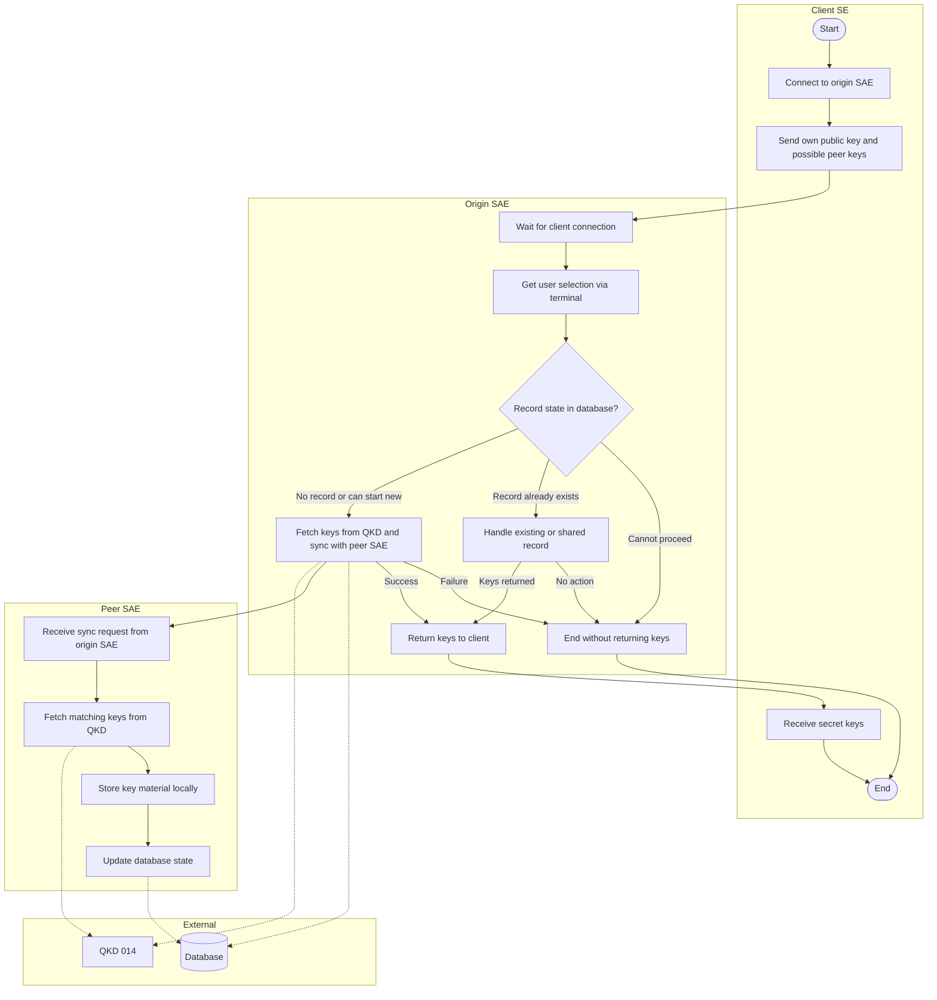
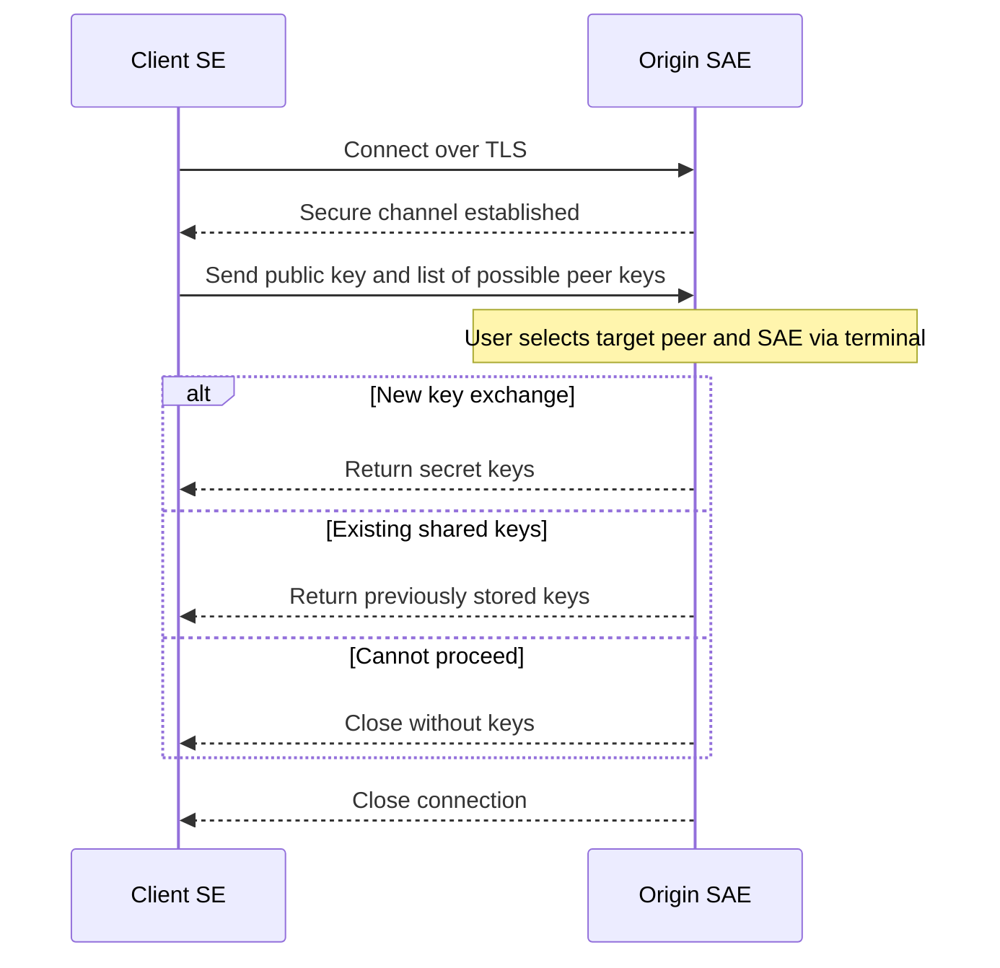
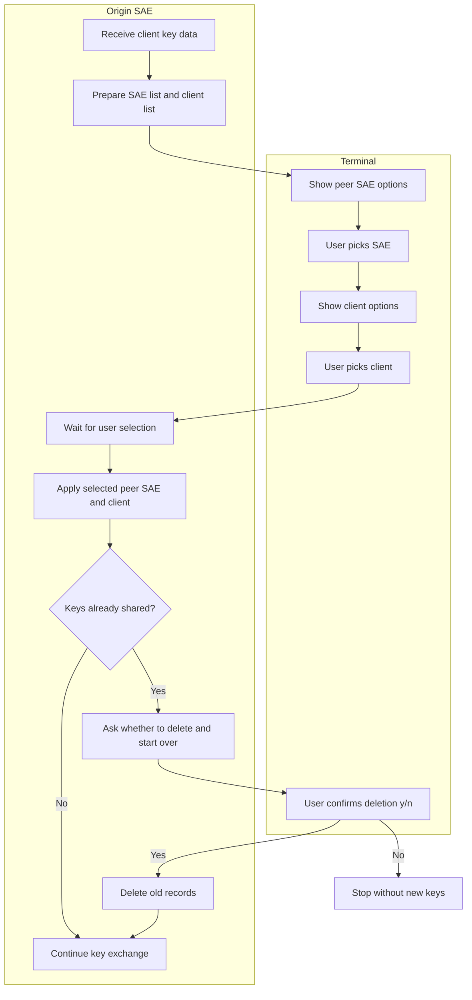
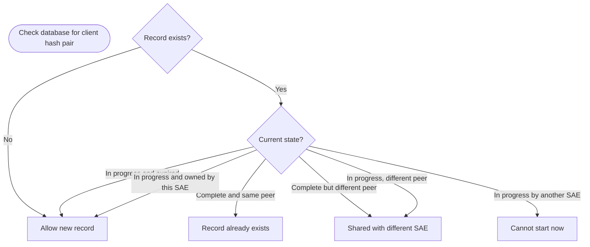
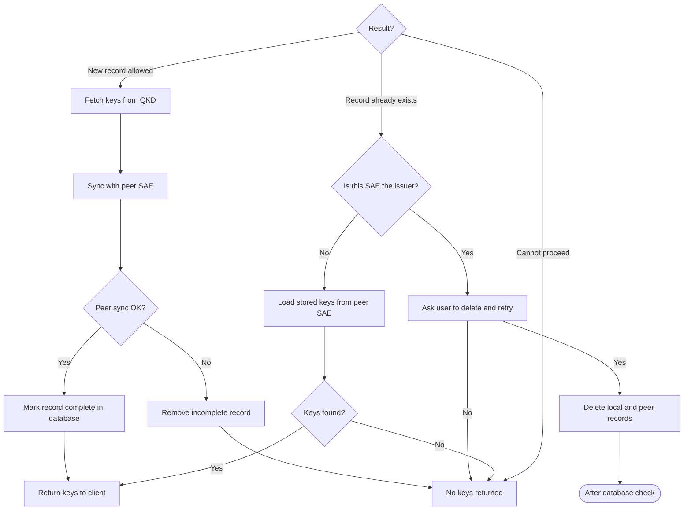
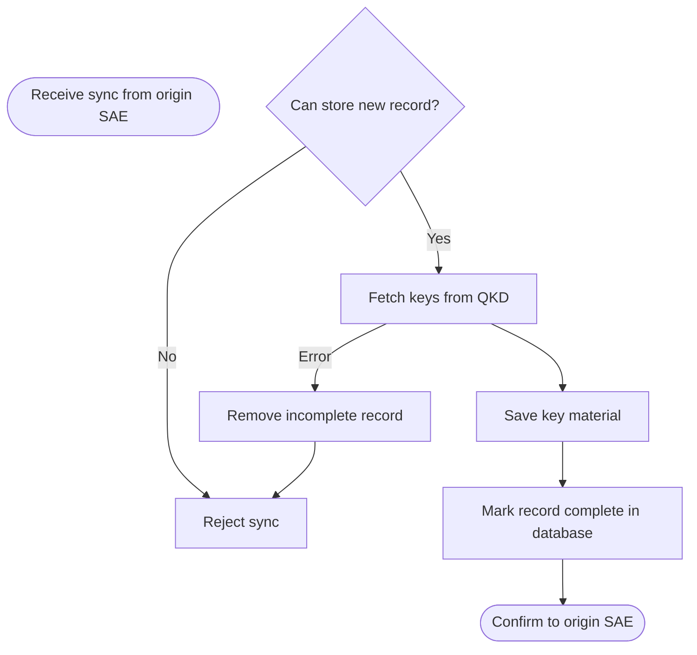
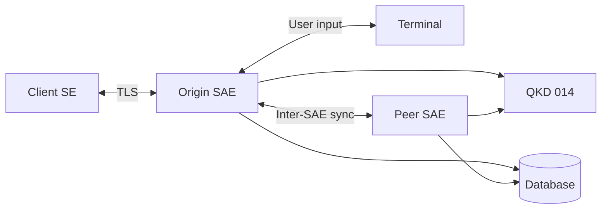

# SAE / SE / Terminal Flowcharts

High-level flowcharts for the key-exchange process. These reflect the actual system behavior but omit internal implementation details.

---

## 1. Main end-to-end flow

---

## 2. SE ↔ SAE communication

---

## 3. Terminal ↔ SAE communication

The terminal is operated locally on the SAE machine. The SAE builds selection lists from the client payload and its configured peer SAEs.

---

## 4. SAE database persistence decisions

The database tracks **record state** (not the key material itself). Key material is stored on the peer SAE.

### 4a. Can a new record be started?

### 4b. What happens after the check?

### 4c. Peer SAE side

---

## Component overview

