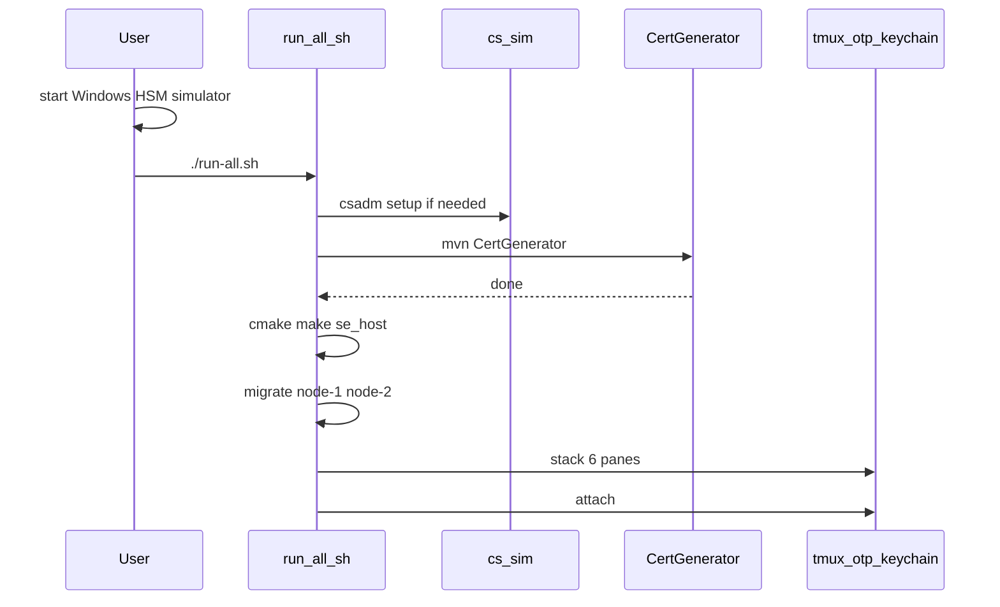

# Run all

Starts the Java **SAE** and **USER** processes and the TROPIC01 host model (`se_host`) from the repo root.

**HSM:** start the Windows simulator yourself (`cs_sim.bat` — [JAVA_APPS HSM setup](JAVA_APPS/README.md#hsm-setup)) so `HSM_DEVICE` in `env/hsm.env` is reachable. These scripts do **not** launch the simulator.

Scripts live in [`scripts/`](scripts/): `hsm.sh`, `java.sh`, `host.sh`, orchestrated by `scripts/run-all.sh`. From the repo root `./run-all.sh` still works.

Unzip the proprietary SDKs into [`ultimaco/hsm-simulator/`](ultimaco/hsm-simulator/README.md) and [`ultimaco/quantum-protect/`](ultimaco/quantum-protect/README.md). SQLite DB files are created under `JAVA_APPS/data/` on migrate/start (e.g. `data/qkd-sae-1.db`).

```bash
# Windows HSM simulator already up, then:
./run-all.sh
```

Detach (`Ctrl-b d`) or interrupt the attached client tears down session `otp-keychain`. Click a pane to focus it, or use **Alt+arrows**. Plain arrows type into the focused pane (`Ctrl-b` then arrows also moves). If a leftover session is still running (for example after `kill -9`):

```bash
tmux kill-session -t otp-keychain
./run-all.sh
```

## What it does



Foreground (calling terminal), in order:

1. Copy `JAVA_APPS/env/terminal-{1,2}.env` and `env/userapp-{1,2}.env` from the examples if they are missing. `env/hsm.env` must already exist.
2. Init nested `stm32u535-trustzone-usb/libtropic` if it is empty.
3. Check `HSM_DEVICE` (`csadm GetState`) and run one-time `csadm` setup if `CXI_HMAC` or PQMI is missing. The simulator is not started here.
4. CertGenerator (`env/hsm.env` sourced; `env/certgen.env` is read by the process).
5. Tropic model venv and `host/tropic_model/_deps` if missing, then `cmake` + `make se_host` (runtime `OWNER`/`CREDS` enrollment; no compile-in creds).
6. Flyway migrate for `env/node-1.env` and `env/node-2.env`.

Then tmux session `otp-keychain` window `stack`. `scripts/host.sh list-panes` and
`scripts/java.sh list-panes` define every pane. `./run-all.sh` only chooses which
of those names to open (see [Configurations](#configurations)). The default
selection is **six rows** top→bottom (pairs are left = 1, right = 2; a row with
one selected pane is full width, including `lab`). Each pane’s name is on its top
border. Pane output is also written to `scripts/logs/<pane>.log` (overwritten each run):

| Row | Left | Right |
| --- | --- | --- |
| 1 tropics | `tropic-1` (port 28992) | `tropic-2` (port 28993) |
| 2 hosts | `se-host-1` (`/tmp/ttyACM-se1`) | `se-host-2` (`/tmp/ttyACM-se2`) |
| 3 SAEs | `node-1` (`env/node-1.env`) | `node-2` (`env/node-2.env`) |
| 4 terminals | `terminal-1` (`env/terminal-1.env`) | `terminal-2` (`env/terminal-2.env`) |
| 5 userapps | `userapp-1` (`env/userapp-1.env`) | `userapp-2` (`env/userapp-2.env`) |
| 6 lab | `lab` (LabSwitchApp: `USER` / `SAE`) — full width | |

Crashed panes stay open (`remain-on-exit`).

Two `se_host` processes are two simulated keychains running **in parallel**.
Lab-only **USB owner** is `/tmp/otp-keychain-lab.json` (see
[LabSwitch](JAVA_APPS/src/LabSwitch/README.md)). There is no CL 1 / CL 2 switch.

| Lab command | Who opens USB | Serial PTYs | Other panes |
| --- | --- | --- | --- |
| `USER` (default) | userapp-1 **and** userapp-2 | both | terminals up without USB |
| `SAE` | terminal-1 **and** terminal-2 | both | userapps idle |

Typical loop:

1. Leave lab on **`USER`**. Bring-up in **userapp-1** and/or **userapp-2** (`INIT LAB` / `INIT PROD`).
2. **Provision:** type **`SAE`**. Both terminal panes enable USB and relay `PROVISION` to SAE 1 and SAE 2.
3. **Encrypt/decrypt / sync key-get:** type **`USER`**, operate both UserApps. Answer SELECT/CONFIRM in **terminal-1** and **terminal-2** when both SAEs ask at once.

On silicon / production run `scripts/java.sh terminal env/terminal-N.env` and `userapp env/userapp-N.env` directly (no lab file). Leave `USB_SERIAL_PORT` unset, or set it to `auto`, and the app scans for the keychain CDC device. For a mixed lab (simulator plus one real board) use `./run-all-with-hw.sh` below.

## Configurations

```bash
./run-all.sh              # scripts/configs/run-all
./run-all-with-hw.sh      # scripts/configs/with-hw
```

A configuration is a list of pane names plus optional `serial` lines. It does not define how a pane starts — that stays in `host.sh` / `java.sh` (`list-panes` also sets the row). Panes that share a row are placed left to right in the order the config names them. `serial client-1|client-2 PATH` is written into the lab file before tmux starts, and `lab-run.py` copies it into `USB_SERIAL_PORT`.

`./run-all-with-hw.sh` does not open `tropic-2` or `se-host-2` (those rows are one full-width pane). client-1 stays on `/tmp/ttyACM-se1`. client-2 is `auto`, so **terminal-2** and **userapp-2** scan for the keychain CDC device (USB `0483:5710`, whatever `ttyACM*` node the kernel assigned) — UserApp while owner is `USER`, TerminalBridge while owner is `SAE`. SAE, terminal, and userapp rows stay split. Pin one node with `serial client-2 /dev/ttyACM1` in `scripts/configs/with-hw` when more than one board is plugged in.

## Prerequisites

- Java 21, Maven, Python 3, cmake, a C compiler, make, tmux, git
- Utimaco SDKs under `ultimaco/` (not committed) and JCE jars under `JAVA_APPS/vendor/` (not committed)
- SQLite with one database file per node

UserApp waits for USB CDC (`USB_SERIAL_PORT`). In the default lab stack each userapp pane
is pinned to `/tmp/ttyACM-se1` or `/tmp/ttyACM-se2`. `./run-all-with-hw.sh` sets client-2 to `auto`.

Manual simulator commands: [JAVA_APPS README — HSM setup](JAVA_APPS/README.md#hsm-setup).
