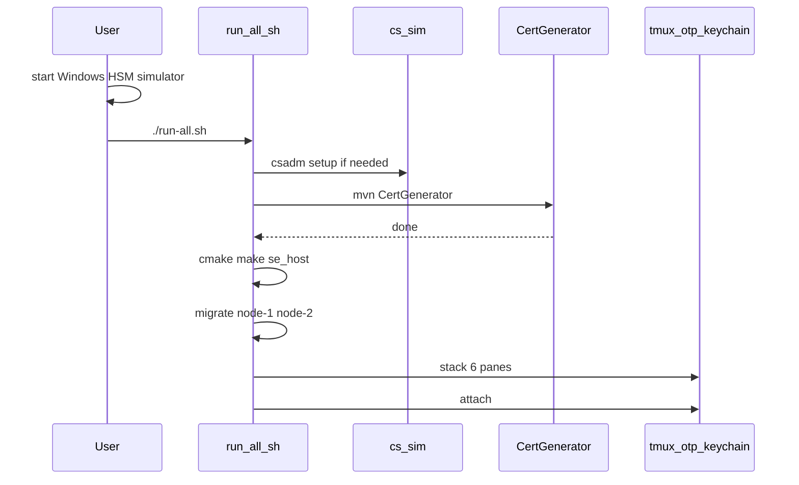

# Run all

Starts the Java SAE stack and the TROPIC01 host model (`se_host`) from the repo root.

**HSM:** start the Windows simulator yourself (`cs_sim.bat` — [JAVA_TLS_TEST HSM setup](JAVA_TLS_TEST/README.md#hsm-setup)) so `HSM_DEVICE` in `env/hsm.env` is reachable. These scripts do **not** launch the simulator.

Scripts live in [`scripts/`](scripts/): `hsm.sh`, `java.sh`, `host.sh`, orchestrated by `scripts/run-all.sh`. From the repo root `./run-all.sh` still works.

Unzip the proprietary SDKs into [`ultimaco/hsm-simulator/`](ultimaco/hsm-simulator/README.md) and [`ultimaco/quantum-protect/`](ultimaco/quantum-protect/README.md). PostgreSQL databases `qkd-db-sae-1` and `qkd-db-sae-2` must already exist (`createdb`).

```bash
# Windows HSM simulator already up, then:
./run-all.sh
```

Detach (`Ctrl-b d`) or interrupt the attached client tears down session `otp-keychain`. Click a pane to focus it, or use **Alt+arrows**. Plain arrows type into the focused pane (`Ctrl-b` then arrows also moves). If a leftover session is still running (for example after `kill -9`):

```bash
tmux kill-session -t otp-keychain
./run-all.sh
```

## What it does



Foreground (calling terminal), in order:

1. Copy `JAVA_TLS_TEST/env/terminal-1.env` and `env/userapp.env` from the examples if they are missing. `env/hsm.env` must already exist.
2. Init nested `stm32u535-trustzone-usb/libtropic` if it is empty.
3. Check `HSM_DEVICE` (`csadm GetState`) and run one-time `csadm` setup if `CXI_HMAC` or PQMI is missing. The simulator is not started here.
4. CertGenerator (`env/hsm.env` sourced; `env/certgen.env` is read by the process).
5. Tropic model venv and `host/tropic_model/_deps` if missing, then `cmake` + `make se_host` (runtime `OWNER`/`CREDS` enrollment; no compile-in creds).
6. Flyway migrate for `env/node-1.env` and `env/node-2.env`.

Then tmux session `otp-keychain` window `stack` (2 columns × 3 rows, with tropic / se-host / userapp split). Each pane’s name is on its top border. Pane output is also written to `scripts/logs/<pane>.log` (overwritten each run):

| Pane | Title | Process |
| --- | --- | --- |
| top-left | `tropic-1` | TROPIC01 `model_server` port 28992 |
| top-left (split) | `tropic-2` | TROPIC01 `model_server` port 28993 |
| mid-left | `node-1` | SAE node 1 (`env/node-1.env`) |
| bottom-left | `node-2` | SAE node 2 (`env/node-2.env`) |
| top-right | `terminal` | TerminalBridge (`env/terminal-1.env`) |
| mid-right | `userapp` | UserApp (`env/userapp.env`) |
| mid-right (split) | `lab` | LabSwitchApp (`USER` / `SAE` / `CL 1` / `CL 2`) |
| bottom-right | `se-host-1` | `se_host --tty /tmp/ttyACM-se1 --tropic-port 28992` |
| bottom-right (split) | `se-host-2` | `se_host_2 --tty /tmp/ttyACM-se2 --tropic-port 28993` |

Crashed panes stay open (`remain-on-exit`).

Two `se_host` processes are two simulated keychains. Lab-only **cable switch**
is the shared file `/tmp/otp-keychain-lab.json` (see [LabSwitch](JAVA_TLS_TEST/src/LabSwitch/README.md)).
The existing `terminal` and `userapp` panes run `scripts/java.sh lab-terminal` /
`lab-userapp`: same splits and titles; the wrapper restarts those JVMs with new
`USB_SERIAL_PORT` / `NODE_*` when owner or client changes. Production Java does
not read the lab file.

| Lab command | Who opens USB | Serial PTY | Terminal TCP target |
| --- | --- | --- | --- |
| `USER` (default) | UserApp / bring-up | selected client | idle (terminal pane waits) |
| `SAE` | Terminal USB bridge | selected client | that client's SAE (1 or 2) |
| `CL 1` | unchanged | `/tmp/ttyACM-se1` | SAE 1 (node-1) when owner is SAE |
| `CL 2` | unchanged | `/tmp/ttyACM-se2` | SAE 2 (node-2) when owner is SAE |

Typical loop:

1. Leave lab on **`USER`**. `CL 1` or `CL 2` only picks the keychain. Bring-up in UserApp (`INIT`, or chip lines `TROPIC KEYGEN` / `TROPIC KEM INIT`).
2. **Provision:** type **`SAE`**. The terminal pane restarts TerminalApp on that client's PTY and relays to SAE 1 or SAE 2 (`PROVISION` on each start).
3. **Encrypt/decrypt:** type **`USER`**, then `ENCRYPT` / `DECRYPT` in UserApp (same selected client).

On silicon / production run `scripts/java.sh terminal` and `userapp` directly (one `/dev/ttyACM0`, no lab file).

## Prerequisites

- Java 21, Maven, Python 3, cmake, a C compiler, make, tmux, git
- Utimaco SDKs under `ultimaco/` (not committed) and JCE jars under `JAVA_TLS_TEST/vendor/` (not committed)
- PostgreSQL with one database per node

UserApp waits for USB CDC (`USB_SERIAL_PORT`). In the lab stack the userapp pane
wrapper sets that to `/tmp/ttyACM-se1` or `/tmp/ttyACM-se2` from the lab file.

Manual simulator commands: [JAVA_TLS_TEST README — HSM setup](JAVA_TLS_TEST/README.md#hsm-setup).
